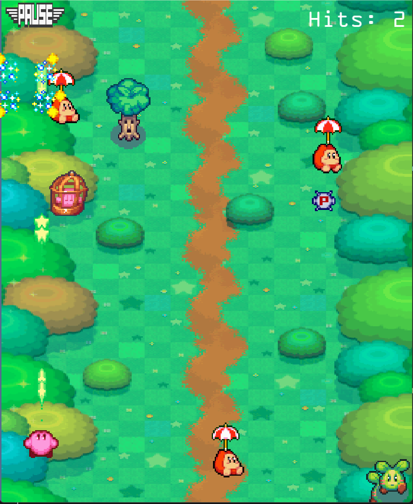

# Python Game Development

## Name
Kirby Mass attack ! Strato patrol EOS

## Members
- Eugénie Patard
- Nicolas Alves Dos Reis
- Yehiya Monla
- Mohamed Aziz Bchir
- Constanza VICENCIO CERESETO

## Description
The game draws inspiration from the sub-game Strato Patrol EOS featured in Kirby Mass Attack, originally released on the Nintendo DS. In this exciting mini-game, players guide multiple Kirbys through colorful skies, dodging obstacles and defeating enemies in a fast-paced aerial adventure.

Strato Patrol EOS utilized the Nintendo DS's unique features, including dual screens, to enhance gameplay and immersion. This version adapts the original concept for computers, improving graphics and controls while retaining the charm of the original. Players can now enjoy this delightful flying adventure on a larger screen with a fresh twist!

## photo démo

## Installation
Notre jeu marche pour une version de python 3.10.6 64-bits ou dessus.
Les modules à importer :
>pip install pygame os random

## Usage
1. Pour exécuter le jeu, il faut exécuter le fichier kirby_game.py : https://gitlab-cw4.centralesupelec.fr/medaziz.bchir/cm_gr20/-/blob/main/kirby_game.py
2. Voici les commandes utiles pour jouer à notre jeu:
>flèches du bas, haut, gauche, droite pour se déplacer
>le personnage tire tout seul des missiles, aucun besoin d'appyuer sur une touche

## Support
Pour avoir de l'aide, contactez :
* constanza.vicencio@student-cs.fr
* medaziz.bchir@student-cs.fr
* nicolas.alves-dos-reis@student-cs.fr
* yehiya.monla@student-cs.fr
* eugenie.patard@student-cs.fr

## Roadmap
Pour le futur, on implémentera des niveaux de difficultés dans notre jeu et des mondes différents avec des monstres différents.

## Contributing
Pour tester le code principale (kirby_game.py), utiliser les fichiers test_kirby_game.py : https://gitlab-cw4.centralesupelec.fr/medaziz.bchir/cm_gr20/-/blob/main/test_kirby_game.py

